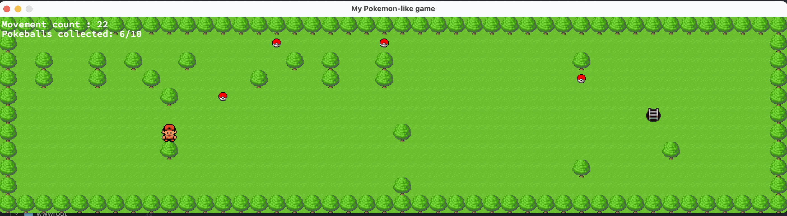
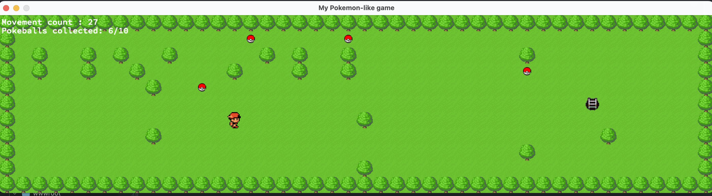

# so_long
# **Installation**
`git clone [https://github.com/votre-utilisateur/so_long.git](https://github.com/Melyssali/so_long.git)`  
`cd so_long`
# **Compilez le projet avec la commande**
`make`
# **Lancez le jeu avec une carte au format .ber**
`./so_long ./maps/big_map.ber`  

;
;
